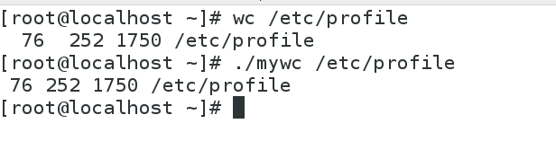

# Linux 程序设计 实验三报告
*董本超--131130137*

## 概要
本文档为Linux程序设计实验三的实验报告文档，实验内容为：
> 使用自己熟悉的程序设计语言（如C语言），编程实现`ls`和`wc`命令，要求实现如下参数与功能：  
> `ls –l(-d, -R, -a, -i)‏`  
> `wc [filename]`  

本文档主要内容包含自己实现的`ls`和`wc`与linux源码中对应命令在使用功能上的异同点以及在设计上的异同点，即综合了**Specification文档**和**设计文档**。文档参考的Linux系统官方源代码为 *coreutils-8.27* 版本。

## `ls`命令
### 功能使用
#### 相同点


#### 不同点


### 设计方式
#### 相同点

#### 不同点


## `wc`命令
### 功能使用
#### 相同点
如下图所示，系统原始的wc和自己实现的wc在对普通文件的字符、单词和行数统计上输出的数据是一样的，两者在性能上也没有明显差距。



#### 不同点
两个wc的主要区别在于系统原始的wc命令后面可以不加文件名，此时会从`stdin`获得输入数据，而自己实现的wc不具备该功能。而且系统的wc可以加入`-c -l`等选项，my_wc也没有这个功能。（*实验要求中没有要求实现这些功能，故省略了对应的实现*）
### 设计方式
linux系统原始代码的wc实现中，其核心逻辑位于wc.c文件的`wc`函数中，而wc函数的核心逻辑位于一个`do-while`循环中，其代码如下：
<a name="n1"></a>
```c
            do
            {
              wchar_t wide_char;
              size_t n;

              if (!in_shift && is_basic (*p))
                {
                  /* Handle most ASCII characters quickly, without calling
                     mbrtowc().  ****/
                  n = 1;
                  wide_char = *p;
                }
              else
                {
                  in_shift = true;
# if SUPPORT_OLD_MBRTOWC
                  backup_state = state;
# endif
                  n = mbrtowc (&wide_char, p, bytes_read, &state);
                  if (n == (size_t) -2)
                    {
# if SUPPORT_OLD_MBRTOWC
                      state = backup_state;
# endif
                      break;
                    }
                  if (n == (size_t) -1)
                    {
                      /* Remember that we read a byte, but don't complain
                         about the error.  Because of the decoding error,
                         this is a considered to be byte but not a
                         character (that is, chars is not incremented).  ****/
                      p++;
                      bytes_read--;
                      continue;
                    }
                  if (mbsinit (&state))
                    in_shift = false;
                  if (n == 0)
                    {
                      wide_char = 0;
                      n = 1;
                    }
                }
              p += n;
              bytes_read -= n;
              chars++;
              switch (wide_char)
                {
                case '\n':
                  lines++;
                  /* Fall through. ****/
                case '\r':
                case '\f':
                  if (linepos > linelength)
                    linelength = linepos;
                  linepos = 0;
                  goto mb_word_separator;
                case '\t':
                  linepos += 8 - (linepos % 8);
                  goto mb_word_separator;
                case ' ':
                  linepos++;
                  /* Fall through. ****/
                case '\v':
                mb_word_separator:
                  words += in_word;
                  in_word = false;
                  break;
                default:
                  if (iswprint (wide_char))
                    {
                      int width = wcwidth (wide_char);
                      if (width > 0)
                        linepos += width;
                      if (iswspace (wide_char))
                        goto mb_word_separator;
                      in_word = true;
                    }
                  break;
                }
            }
          while (bytes_read > 0);
```
> **注：** 以上代码处理了字符类型不止标准ASCII码类型的文本，即中文等语言，而源文件中也有一段处理标准ASCII码的程序，因为两者逻辑基本相同，这里仅贴出这一段。

而我自己实现的代码在文件*my_wc.c*中，这里不再重复贴出。

#### 相同点
1. 两份代码对字符个数、单词个数和行数的计数判断逻辑上两者是几乎相同的。两者都是读取文件流中的字符，每遇到一个字符就将字符个数加一（my_wc.c中的`c_cnt`，和上面代码中的`chars`）,遇到空白符号（空格、制表符等）时，如果当前**正在一个单词内部**，则单词数加一，否则不加（"单词内部"的判定在官方代码中体现为`in_word`变量，每当遇到空白符时，都会通过语句`goto mb_word_separator`来进行单词数的处理，并置`in_word`变量；在*my_wc*中则通过变量`was_blank`体现出来）；两份代码对于行数的处理都是每遇到一个换行符就将行数加一。
2. 两份代码对于文件内容的读取都采用了缓存机制，即一次不是读取一个字符而是读取多个。在linux源代码中是通过`safe_read`函数实现的，其中由一个叫做`buf`的数组来缓存：
```c
while ((bytes_read = safe_read (fd, buf + prev, BUFFER_SIZE - prev)) > 0)
{
  ...
}
```
而我的代码中也是通过声明了一个`buff`数组来缓存的：
```c
char buff[MAX_LINE];
while (!feof(fp)) {
        if(fgets(buff, MAX_LINE, fp)){
          ...
        }
        ...
      }
```

#### 不同点
两份代码的设计不同点主要体现在以下几个方面：
1. Linux源代码考虑了非纯ASCII码的文本类型，其实现方法已经在[上述代码段](#n1)中给出。而且它在处理非ASCII字符的同时还会先判断字符是不是ASCII字符：
```c
if (!in_shift && is_basic (*p))
  {
    /* Handle most ASCII characters quickly, without calling
       mbrtowc().  */
    n = 1;
    wide_char = *p;
  }
```
这样对于ASCII字符就可以节省处理开销，增强性能。对于哪些非ASCII字符，它使用`n = mbrtowc (&wide_char, p, bytes_read, &state)`函数将其进行扩展，再判断`wide_char`来进行单词的计数。  
而*my_wc*中简化了实现，只能处理ASCII类型的字符。
2. Linux源代码中对于空白符的处理不仅有空格，`\t`，`\n`，还有`\r`，`\f`和`\v`，而在*my_wc*中，将所有ASCII码表排在空格（0x20）之前的符号均视为空白符，如下：
```c
int is_blank(char c) {
      return c<=' ';
}
```
