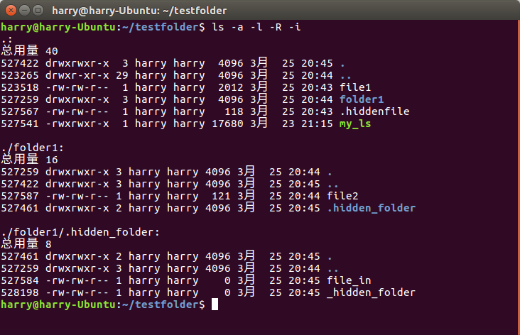

# Linux 程序设计 实验三报告
*董本超--131130137*

## 概要
本文档为Linux程序设计实验三的实验报告文档，实验内容为：
> 使用自己熟悉的程序设计语言（如C语言），编程实现`ls`和`wc`命令，要求实现如下参数与功能：  
> `ls –l(-d, -R, -a, -i)‏`  
> `wc [filename]`  

本文档主要内容包含自己实现的`ls`和`wc`与linux源码中对应命令在使用功能上的异同点以及在设计上的异同点，即综合了**Specification文档**和**设计文档**。文档参考的Linux系统官方源代码为 *coreutils-8.27* 版本。

## `ls`命令
### 功能使用
#### 相同点
如下面两张图所示，`ls`和`my_ls`对于基本信息的展示内容时大部分相同的。两者都列出了基本的权限、inode号、文件大小、拥有者等信息，在数据的正确性上`my_ls`也没有错误。




#### 不同点
但是`my_ls`和标准的`ls`还是有很多区别的，主要体现在下面几个方面：
1. `my_ls`打印的信息没有颜色区分，而标准`ls`对与普通文件、目录、链接等不同文件都可以有不同的颜色表示。
2. `my_ls`打印条目的顺序不是按照文件名称顺序排列的，而`ls`默认按照文件名字符顺序排列，而且可以指定不同的排序方式。
3. 在没有`-l`选项时，`my_ls`是按照从左往右，从上往下的顺序依次打印信息的，而标准的`ls`则是将需要打印的信息预先分成几列，每一列再从上往下打印，打印玩了向右移动一列接着打印。
4. `my_ls`打印时没有对齐功能，尤其在没有`-l`选项时更明显，而`ls`打印的信息都是对齐的。
5. `ls`对于时间的处理考虑到了系统的默认语系，即如果系统是中文，那么时间也会用中文来显示，而`my_ls`没有这个功能，时间均用英文显示。

### 设计方式
#### 相同点
两份代码在大体方向上的处理逻辑是相似的，即都是打开目录->读取其中的目录项->输出目录项->对于其中的directory，如果有`-R`则再打开读取。下面简要列出`ls`源代码中关于这一段的核心逻辑：
```c
static void
print_dir (char const *name, char const *realname, bool command_line_arg)
{
  DIR *dirp;
  struct dirent *next;
  uintmax_t total_blocks = 0;
  static bool first = true;

  ...

  if (LOOP_DETECT)
    {
      struct stat dir_stat;
      int fd = dirfd (dirp);

      ...

  /* Read the directory entries, and insert the subfiles into the 'cwd_file'
     table.  */

  while (1)
    {
      /* Set errno to zero so we can distinguish between a readdir failure
         and when readdir simply finds that there are no more entries.  */
      errno = 0;
      next = readdir (dirp);
      if (next)
        {
          if (! file_ignored (next->d_name))
            {
              enum filetype type = unknown;

#if HAVE_STRUCT_DIRENT_D_TYPE
              switch (next->d_type)
                {
                case DT_BLK:  type = blockdev;		break;
                case DT_CHR:  type = chardev;		break;
                case DT_DIR:  type = directory;		break;
                case DT_FIFO: type = fifo;		break;
                case DT_LNK:  type = symbolic_link;	break;
                case DT_REG:  type = normal;		break;
                case DT_SOCK: type = sock;		break;
# ifdef DT_WHT
                case DT_WHT:  type = whiteout;		break;
# endif
                }
#endif
              total_blocks += gobble_file (next->d_name, type,
                                           RELIABLE_D_INO (next),
                                           false, name);

              /* In this narrow case, print out each name right away, so
                 ls uses constant memory while processing the entries of
                 this directory.  Useful when there are many (millions)
                 of entries in a directory.  */
              if (format == one_per_line && sort_type == sort_none
                      && !print_block_size && !recursive)
                {
                  /* We must call sort_files in spite of
                     "sort_type == sort_none" for its initialization
                     of the sorted_file vector.  */
                  sort_files ();
                  print_current_files ();
                  clear_files ();
                }
            }
        }
      else if (errno != 0)
        {
          file_failure (command_line_arg, _("reading directory %s"), name);
          if (errno != EOVERFLOW)
            break;
        }
      else
        break;

      /* When processing a very large directory, and since we've inhibited
         interrupts, this loop would take so long that ls would be annoyingly
         uninterruptible.  This ensures that it handles signals promptly.  */
      process_signals ();
    }

  ...

  /* Sort the directory contents.  */
  sort_files ();

  /* If any member files are subdirectories, perhaps they should have their
     contents listed rather than being mentioned here as files.  ****/

  if (recursive)
    extract_dirs_from_files (name, false);

  ...

  if (cwd_n_used)
    print_current_files ();
}
```
#### 不同点
`ls`与`my_ls`一个重要的不同在于`ls`中对于每个需要列出信息的文件项，都使用了一个结构体来存储其具体信息：
```c
struct fileinfo
  {
    /* The file name.  */
    char *name;

    /* For symbolic link, name of the file linked to, otherwise zero.  */
    char *linkname;

    struct stat stat;

    enum filetype filetype;

    /* For symbolic link and long listing, st_mode of file linked to, otherwise
       zero.  */
    mode_t linkmode;

    /* security context.  */
    char *scontext;

    bool stat_ok;

    /* For symbolic link and color printing, true if linked-to file
       exists, otherwise false.  */
    bool linkok;

    /* For long listings, true if the file has an access control list,
       or a security context.  */
    enum acl_type acl_type;

    /* For color listings, true if a regular file has capability info.  */
    bool has_capability;

    /* Whether file name needs quoting. tri-state with -1 == unknown.  ****/
    int quoted;
  };
```

而且还有一个向量`sorted_file`存储着目前需要处理的文件项：
```c
/* Vector of pointers to files, in proper sorted order, and the number
   of entries allocated for it.  */
static void **sorted_file;
```

对于目录文件，`ls`在每次遍历中会把目录提取出来缓存在一个叫`struct pending`的结构体中：
```c
struct pending
  {
    char *name;
    /* If the directory is actually the file pointed to by a symbolic link we
       were told to list, 'realname' will contain the name of the symbolic
       link, otherwise zero.  */
    char *realname;
    bool command_line_arg;
    struct pending *next;
  };
```
这样在由递归`-R`选项时就可以从`pending`链表中拿出目录打开接着遍历。

而我自己实现的`my_ls`代码中都不会还粗这些结构体，而是直接将文件名或者目录名都统一放在`char cwd[MAX_LENGTH];`全局变量中，这样造成的结果时每次要打印文件信息都只能打开目录并一个一个的读取、打印，无法进行排序等操作。而对于目录文件，当存在`-R`时，`my_ls`会将打开的目录再次遍历一遍，并对其中的directory继续打开并递归的遍历：
```c
if (S_ISDIR(stat_buff.st_mode)){    //is directory
    if (has_opt("-a")){
        handle_R(entry->d_name);
    } else{
        if (*(entry->d_name) != '.'){
            handle_R(entry->d_name);
        }
    }
} else{ //not directory
    //do nothing
}
```
这样操作失去了一定的灵活性（如不能排序），而且要多遍历一次，但好处是不需要额外的空间去缓存每一个文件的信息，节省了空间。

在上面关于`ls`功能使用的不同点中，我们已经列出了5点重要的不同，下面主要针对这5点解释其在源代码设计上的体现。
#### 1. 颜色区分
在`ls`的源码中，对于颜色的处理方案有以下几种：
```c
enum color_type
  {
    color_never,		/* 0: default or --color=never */
    color_always,		/* 1: --color=always */
    color_if_tty		/* 2: --color=tty ****/
  };
```
虽然在ls中默认是`color_never`，但是大部分linux发行版都会通过`alias`命令将其改掉：
```shell
alias ls='ls --color=auto'
```
因此我们看到的时候就都有颜色区分了。
在代码实现中，每次需要打印前，都会调用`static bool print_color_indicator (const struct bin_str *ind)`方法，其内部又调用`put_indicator`方法在对应位置置颜色，因此也就有了颜色的区分。
```c
static bool
print_color_indicator (const struct bin_str *ind)
{
  if (ind)
    {
      /* Need to reset so not dealing with attribute combinations ****/
      if (is_colored (C_NORM))
        restore_default_color ();
      put_indicator (&color_indicator[C_LEFT]);
      put_indicator (ind);
      put_indicator (&color_indicator[C_RIGHT]);
    }

  return ind != NULL;
}
```

#### 2. 打印条目顺序
源代码中有一个`static void sort_files(void)`方法，每次在打印前都会调用其对待输出的目录项进行排序，因此打印出的条目都按照一定的顺序。其中排序方式由一个枚举变量指定，如下面代码段所示：
```c
enum sort_type
  {
    sort_none = -1,		/* -U */
    sort_name,			/* default */
    sort_extension,		/* -X */
    sort_size,			/* -S */
    sort_version,		/* -v */
    sort_time,			/* -t */
    sort_numtypes		/* the number of elements of this enum ****/
  };

static enum sort_type sort_type;
```

#### 3. 从上往下打印的实现
标准`ls`中，有个`calculate_columns`函数，它能计算出目前一行最多可以列出几列，这样在打印前就能预先进行初步的排版，从而在打印每一行时不用按照文件顺序打印。比如目前算出来可以有4列，而待打印的有12个文件项，那么在打印第一行时就可以打印第1，4，7，10项，于是这就实现了纵向打印的效果。实际上在源代码4723行左右的打印函数`static void
print_many_per_line (void)`函数中确实调用了`calculate_columns`来计算列数。
```c
/* Calculate the number of columns needed to represent the current set
   of files in the current display width.  */

static size_t
calculate_columns (bool by_columns)
{
  ...
}
```

#### 4. 对齐功能
代码中有如下全局变量记录了不同字段的最大长度：
```c
/* The number of columns to use for columns containing inode numbers,
   block sizes, link counts, owners, groups, authors, major device
   numbers, minor device numbers, and file sizes, respectively.  */

static int inode_number_width;
static int block_size_width;
static int nlink_width;
static int scontext_width;
static int owner_width;
static int group_width;
static int author_width;
static int major_device_number_width;
static int minor_device_number_width;
static int file_size_width;
```
在遍历目录中的文件时，在`static uintmax_t
gobble_file (char const *name, enum filetype type, ino_t inode, bool command_line_arg, char const *dirname)`函数中会对每个文件的对用这些项的值的长度与当前最大值做比较，在全部遍历完成后，就可以得出在打印时需要填充的空格的数量，于是可以实现对齐功能。

#### 5. 语系支持
`ls`的源代码中在输出时间时使用了系统的环境变量`LC_TIME`，于是可以获得系统的语系，从而对不同的国家打印不同的时间效果。

## `wc`命令
### 功能使用
#### 相同点
如下图所示，系统原始的wc和自己实现的wc在对普通文件的字符、单词和行数统计上输出的数据是一样的，两者在性能上也没有明显差距。


#### 不同点
两个wc的主要区别在于系统原始的wc命令后面可以不加文件名，此时会从`stdin`获得输入数据，而自己实现的wc不具备该功能。而且系统的wc可以加入`-c -l`等选项，my_wc也没有这个功能。（*实验要求中没有要求实现这些功能，故省略了对应的实现*）
### 设计方式
linux系统原始代码的wc实现中，其核心逻辑位于wc.c文件的`wc`函数中，而wc函数的核心逻辑位于一个`do-while`循环中，其代码如下：
<a name="n1"></a>
```c
            do
            {
              wchar_t wide_char;
              size_t n;

              if (!in_shift && is_basic (*p))
                {
                  /* Handle most ASCII characters quickly, without calling
                     mbrtowc().  ****/
                  n = 1;
                  wide_char = *p;
                }
              else
                {
                  in_shift = true;
# if SUPPORT_OLD_MBRTOWC
                  backup_state = state;
# endif
                  n = mbrtowc (&wide_char, p, bytes_read, &state);
                  if (n == (size_t) -2)
                    {
# if SUPPORT_OLD_MBRTOWC
                      state = backup_state;
# endif
                      break;
                    }
                  if (n == (size_t) -1)
                    {
                      /* Remember that we read a byte, but don't complain
                         about the error.  Because of the decoding error,
                         this is a considered to be byte but not a
                         character (that is, chars is not incremented).  ****/
                      p++;
                      bytes_read--;
                      continue;
                    }
                  if (mbsinit (&state))
                    in_shift = false;
                  if (n == 0)
                    {
                      wide_char = 0;
                      n = 1;
                    }
                }
              p += n;
              bytes_read -= n;
              chars++;
              switch (wide_char)
                {
                case '\n':
                  lines++;
                  /* Fall through. ****/
                case '\r':
                case '\f':
                  if (linepos > linelength)
                    linelength = linepos;
                  linepos = 0;
                  goto mb_word_separator;
                case '\t':
                  linepos += 8 - (linepos % 8);
                  goto mb_word_separator;
                case ' ':
                  linepos++;
                  /* Fall through. ****/
                case '\v':
                mb_word_separator:
                  words += in_word;
                  in_word = false;
                  break;
                default:
                  if (iswprint (wide_char))
                    {
                      int width = wcwidth (wide_char);
                      if (width > 0)
                        linepos += width;
                      if (iswspace (wide_char))
                        goto mb_word_separator;
                      in_word = true;
                    }
                  break;
                }
            }
          while (bytes_read > 0);
```
> **注：** 以上代码处理了字符类型不止标准ASCII码类型的文本，即中文等语言，而源文件中也有一段处理标准ASCII码的程序，因为两者逻辑基本相同，这里仅贴出这一段。

而我自己实现的代码在文件*my_wc.c*中，这里不再重复贴出。

#### 相同点
1. 两份代码对字符个数、单词个数和行数的计数判断逻辑上两者是几乎相同的。两者都是读取文件流中的字符，每遇到一个字符就将字符个数加一（my_wc.c中的`c_cnt`，和上面代码中的`chars`）,遇到空白符号（空格、制表符等）时，如果当前**正在一个单词内部**，则单词数加一，否则不加（"单词内部"的判定在官方代码中体现为`in_word`变量，每当遇到空白符时，都会通过语句`goto mb_word_separator`来进行单词数的处理，并置`in_word`变量；在*my_wc*中则通过变量`was_blank`体现出来）；两份代码对于行数的处理都是每遇到一个换行符就将行数加一。
2. 两份代码对于文件内容的读取都采用了缓存机制，即一次不是读取一个字符而是读取多个。在linux源代码中是通过`safe_read`函数实现的，其中由一个叫做`buf`的数组来缓存：
```c
while ((bytes_read = safe_read (fd, buf + prev, BUFFER_SIZE - prev)) > 0)
{
  ...
}
```
而我的代码中也是通过声明了一个`buff`数组来缓存的：
```c
char buff[MAX_LINE];
while (!feof(fp)) {
        if(fgets(buff, MAX_LINE, fp)){
          ...
        }
        ...
      }
```

#### 不同点
两份代码的设计不同点主要体现在以下几个方面：
1. Linux源代码考虑了非纯ASCII码的文本类型，其实现方法已经在[上述代码段](#n1)中给出。而且它在处理非ASCII字符的同时还会先判断字符是不是ASCII字符：
```c
if (!in_shift && is_basic (*p))
  {
    /* Handle most ASCII characters quickly, without calling
       mbrtowc().  */
    n = 1;
    wide_char = *p;
  }
```
这样对于ASCII字符就可以节省处理开销，增强性能。对于哪些非ASCII字符，它使用`n = mbrtowc (&wide_char, p, bytes_read, &state)`函数将其进行扩展，再判断`wide_char`来进行单词的计数。  
而*my_wc*中简化了实现，只能处理ASCII类型的字符。
2. Linux源代码中对于空白符的处理不仅有空格，`\t`，`\n`，还有`\r`，`\f`和`\v`，而在*my_wc*中，将所有ASCII码表排在空格（0x20）之前的符号均视为空白符，如下：
```c
int is_blank(char c) {
      return c<=' ';
}
```
